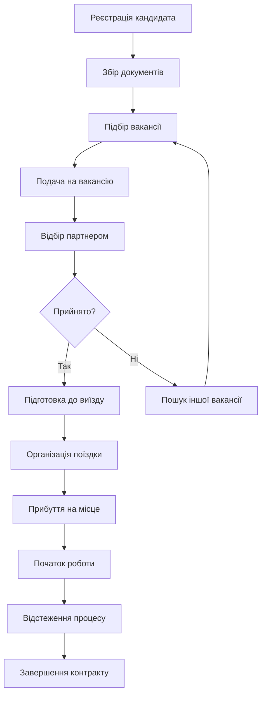
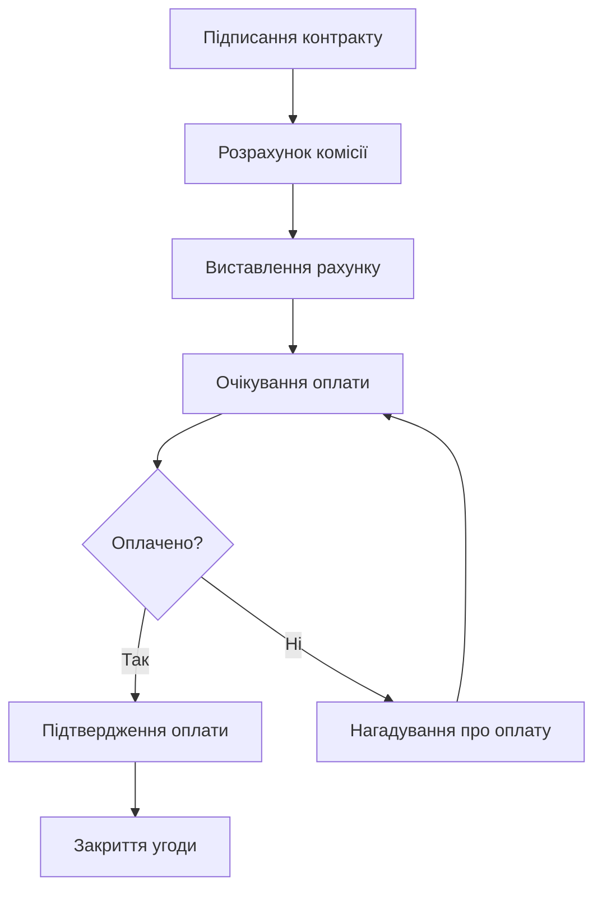

# 📋 Європа Сервіс CRM - Бізнес Логіка та Процеси

## 📊 **Загальна інформація про проект**

**Назва:** Європа Сервіс CRM  
**Тип:** Система управління персоналом та працевлаштування  
**Статус:** В розробці / Продакшн  
**Версія:** 2.0  
**Останнє оновлення:** 2024-10-14  

---

## 🎯 **Бізнес-модель та цілі**

### **Основна діяльність:**
- Ліцензоване кадрове агенство
- Працевлаштування в країнах Європи
- Робота з партнерами в Польщі, Німеччині, Чехії та інших країнах ЄС

### **Цільові показники:**
- **Кандидати:** 1000+ активних кандидатів
- **Вакансії:** 100+ активних вакансій
- **Оборот:** €2.4M+ загальний оборот
- **Філії:** 5 філій по Україні

---

## 👥 **Ролі та права доступу**

### **ADMIN (Системний адміністратор)**
- ✅ Повний доступ до всіх модулів
- ✅ Управління користувачами
- ✅ Перегляд видалених записів
- ✅ Аудит логів та відкат змін
- ✅ Налаштування системи

### **DIRECTOR (Директор)**
- ✅ Перегляд статистики
- ✅ Доступ до фінансових звітів
- ✅ Управління кандидатами
- ✅ Перегляд всіх філій

### **MANAGER (Менеджер)**
- ✅ Управління кандидатами своєї філії
- ✅ Перегляд вакансій
- ✅ Робота з поданнями
- ❌ Немає доступу до статистики

### **ACCOUNTANT (Бухгалтер)**
- ✅ Перегляд статистики
- ✅ Фінансові звіти
- ✅ Оплати та витрати
- ✅ Зарплати співробітників

### **EMPLOYEE (Співробітник)**
- ✅ Базовий доступ до кандидатів
- ✅ Перегляд вакансій
- ❌ Обмежені права редагування

---

## 🏢 **Структура філій**

### **Центральний офіс (ЦО)**
- **Локація:** Київ
- **Роль:** Координація всіх філій
- **Менеджер:** Системний адміністратор

### **Регіональні філії:**
1. **Київ** - Центральна філія
2. **Львів** - Західна філія  
3. **Одеса** - Південна філія
4. **Харків** - Східна філія
5. **Дніпро** - Центрально-східна філія

---

## 📋 **Основні модулі системи**

### **1. Кандидати** 👥
**Призначення:** Управління базою кандидатів

**Поля даних:**
- **Особисті дані:** Ім'я, прізвище, телефон, email, вік
- **Документи:** Паспорт, термін дії, номер заявки
- **Освіта:** Рівень освіти, досвід роботи, мовні навички
- **Сім'я:** Сімейний стан, кількість дітей
- **Робота:** Країна призначення, проект, партнер
- **Статуси:** Статус кандидата, оплата, дата прибуття
- **Фінанси:** Сума оплати, статус оплати, тип отримувача

**Статуси кандидатів:**
- 🆕 **Зареєстровано** - Новий кандидат
- ⏳ **Готовий до виїзду** - Підготовлений до поїздки
- 🚌 **В дорозі** - Їде до місця роботи
- ✅ **Прибув** - Прибув на місце
- 💼 **Працює** - Активно працює
- 🏁 **Завершив роботу** - Завершив контракт
- ❌ **Не доїхав** - Не прибув на місце
- ⏰ **Очікується** - Очікується прибуття

**Процеси:**
1. **Реєстрація** → Створення профілю кандидата
2. **Підготовка** → Збір документів, підготовка до виїзду
3. **Відправка** → Організація поїздки
4. **Прибуття** → Підтвердження прибуття
5. **Робота** → Відстеження робочого процесу
6. **Завершення** → Завершення контракту

### **2. Вакансії** 💼
**Призначення:** Управління вакансіями партнерів

**Поля даних:**
- Назва вакансії
- Країна роботи
- Опис роботи
- Вимоги до кандидата
- Зарплата
- Умови роботи
- Контакти партнера

**Процеси:**
1. **Отримання** → Отримання вакансії від партнера
2. **Публікація** → Розміщення в системі
3. **Підбір** → Пошук підходящих кандидатів
4. **Подача** → Подача кандидатів на вакансію
5. **Відбір** → Процес відбору партнером
6. **Прийняття** → Підтвердження найму

### **3. Подання** 📋
**Призначення:** Управління поданнями кандидатів на вакансії

**Поля даних:**
- Кандидат
- Вакансія
- Дата подання
- Статус подання
- Коментарі партнера
- Результат відбору

**Статуси подань:**
- 📤 **Подано** - Подано на розгляд
- 👀 **Розглядається** - Партнер розглядає
- ✅ **Прийнято** - Кандидат прийнятий
- ❌ **Відхилено** - Кандидат відхилений
- ⏳ **Очікується** - Очікується рішення

### **4. Оплати** 💰
**Призначення:** Облік платежів від партнерів

**Поля даних:**
- Кандидат
- Сума оплати
- Дата оплати
- Статус оплати
- Тип отримувача
- Банківські реквізити
- Спосіб оплати
- Номер референсу

**Статуси оплат:**
- ✅ **Оплачено** - Повністю оплачено
- 🔄 **Частково оплачено** - Часткова оплата
- ❌ **Не оплачено** - Не оплачено
- ⏰ **Очікується** - Очікується оплата

### **5. Статистика** 📊
**Призначення:** Аналітика та звітність

**Доступ:** Тільки для DIRECTOR, ACCOUNTANT, ADMIN

**Метрики:**
- Загальна кількість кандидатів
- Кількість активних вакансій
- Конверсія по філіях
- Фінансові показники
- Статистика по країнах
- Воронка конверсії

### **6. Виплати партнерів** 💸
**Призначення:** Виплати від партнерів (конфіденційно)

**Поля даних:**
- Партнер
- Сума виплати
- Дата виплати
- Тип виплати
- Комісія
- Статус виплати

### **7. Зарплати** 💵
**Призначення:** Зарплати співробітників та бонуси

**Доступ:** DIRECTOR, ACCOUNTANT, ADMIN

**Структура зарплати:**
- **Базова ставка** - фіксована місячна зарплата
- **Бонус за показники** - за кількість оплачених кандидатів
- **Бонус за візи** - комісія від продажу віз
- **Бонус за безкоштовних** - за кандидатів що доїхали безкоштовно
- **Загальна сума** - сума всіх компонентів

**Логіка розрахунку зарплат:**

#### **Менеджери (MANAGER):**
```javascript
// Базові показники
const paidCount = кількість_оплачених_кандидатів_за_місяць
const freeCount = кількість_безкоштовних_кандидатів
const arrivedCount = кількість_кандидатів_що_доїхали

// Градація бонусу за оплачених кандидатів
let gradationRate = 300  // базова ставка
if (paidCount > 30) gradationRate = 600    // 30+ кандидатів
else if (paidCount > 20) gradationRate = 500  // 20-29 кандидатів  
else if (paidCount > 10) gradationRate = 400  // 10-19 кандидатів

// Розрахунок компонентів
const baseSalary = менеджер.базова_ставка
const bonus = paidCount * gradationRate
const freeBonus = arrivedCount * 100
const visaBonus = сума_комісій_від_віз_за_місяць

// Загальна зарплата
const total = baseSalary + bonus + visaBonus + freeBonus
```

#### **Керівники філій (BRANCH_MANAGER):**
```javascript
// Показники філії
const branchPaidCount = кількість_оплачених_кандидатів_філії_за_місяць

// Розрахунок
const baseSalary = 0  // немає базової ставки
const bonus = branchPaidCount * 250  // 250 грн за кожного оплаченого
const visaBonus = 0
const freeBonus = 0

// Загальна зарплата
const total = bonus
```

#### **Адміністратори (ADMIN):**
```javascript
// Фіксована зарплата без бонусів
const baseSalary = адміністратор.базова_ставка
const bonus = 0
const visaBonus = 0
const freeBonus = 0

// Загальна зарплата
const total = baseSalary
```

**Показники для розрахунку:**
- **Оплачені кандидати** - кандидати з `isFree = false`
- **Безкоштовні кандидати** - кандидати з `isFree = true`
- **Доїхали** - кандидати з `arrivedStatus = 'Доїхав'`
- **Комісії від віз** - сума з таблиці `VisaSale`

**Градація бонусів менеджерів:**
- 🥉 **10-19 кандидатів** - 400 грн за кожного
- 🥈 **20-29 кандидатів** - 500 грн за кожного  
- 🥇 **30+ кандидатів** - 600 грн за кожного
- 📊 **Менше 10** - 300 грн за кожного

**Бонуси керівників філій:**
- 💰 **250 грн** за кожного оплаченого кандидата філії
- 🎯 **Тільки за показники філії** - немає базової ставки

### **8. Витрати філій** 📈
**Призначення:** Облік витрат філій

**Категорії витрат:**
- 🏢 **Оренда** - Оренда офісів
- 📞 **Комунікації** - Телефон, інтернет
- 📢 **Маркетинг** - Реклама, просування
- 📄 **Канцтовари** - Офісні приналежності
- 🚗 **Транспорт** - Поїздки, бензин
- 🍽️ **Харчування** - Корпоративні заходи
- 🔧 **Інше** - Інші витрати

### **9. Користувачі** 👤
**Призначення:** Управління користувачами системи

**Поля даних:**
- Логін та пароль
- Роль в системі
- Повне ім'я
- Філія
- Email та телефон
- Статус активності

### **10. Видалені записи** 🗑️
**Призначення:** Перегляд та відновлення видалених записів

**Доступ:** Тільки для ADMIN

**Функції:**
- Перегляд видалених кандидатів
- Відновлення записів
- Перегляд історії видалень
- Остаточне видалення

---

## 🔄 **Бізнес-процеси**

### **Процес працевлаштування:**



### **Процес оплати:**



---

## 📊 **KPI та метрики**

### **Операційні метрики:**
- **Кількість кандидатів:** Загальна та активна база
- **Конверсія:** Від реєстрації до працевлаштування
- **Час обробки:** Середній час від реєстрації до виїзду
- **Успішність:** Відсоток успішних працевлаштувань

### **Фінансові метрики:**
- **Оборот:** Загальний оборот по місяцях
- **Прибуток:** Чистий прибуток після витрат
- **Середній чек:** Середня сума за кандидата
- **ROI:** Окупність інвестицій

### **Якісні метрики:**
- **Задоволеність:** Відгуки кандидатів та партнерів
- **Повторні клієнти:** Відсоток повторних звернень
- **Рекомендації:** Кількість рекомендацій

---

## 🔧 **Технічні процеси**

### **Розрахунок зарплат (автоматичний):**
- **Щомісячний процес** - розрахунок на початку кожного місяця
- **Джерела даних:**
  - `Application` - заявки кандидатів за місяць
  - `VisaSale` - продажі віз за місяць
  - `User` - базові ставки співробітників
- **Алгоритм розрахунку:**
  1. Отримання всіх заявок за попередній місяць
  2. Підрахунок показників по кожному менеджеру
  3. Застосування градації бонусів
  4. Розрахунок комісій від віз
  5. Створення записів `MonthlySalary`
- **Компоненти зарплати:**
  - `baseSalary` - базова ставка з профілю користувача
  - `bonus` - бонус за оплачених кандидатів
  - `visaBonus` - комісія від продажу віз
  - `freeBonus` - бонус за безкоштовних що доїхали
  - `total` - сума всіх компонентів
  - `indicators` - кількість оплачених кандидатів

### **Аудит та логування:**
- Всі зміни записуються в аудит лог
- Можливість відкату змін
- Історія дій користувачів
- Soft delete для всіх записів

### **Безпека:**
- JWT токени для авторизації
- Роль-базова система доступу
- Шифрування паролів
- Валідація всіх вхідних даних

### **Оптимізація:**
- Оптимістичні UI оновлення
- Debounced оновлення для продуктивності
- Пагінація для великих таблиць
- Кешування часто використовуваних даних

---

## 📝 **Зміни та оновлення**

### **2024-12-19 - Версія 2.0**
**Зміни в дизайні:**
- ✅ Повністю новий iOS-подібний дизайн
- ✅ Оновлена головна сторінка з модулями
- ✅ Сучасна сторінка кандидатів з статистикою
- ✅ Покращена сторінка логіну з анімаціями
- ✅ Нові глобальні стилі та кольорова схема

**Технічні покращення:**
- ✅ Новий компонент ModernCandidatesTable
- ✅ Покращені анімації та переходи
- ✅ Адаптивний дизайн для всіх пристроїв
- ✅ Backdrop blur ефекти
- ✅ Покращені скролбари та фокус стани

**Бізнес-логіка:**
- ✅ Збережена вся існуюча функціональність
- ✅ Покращена UX взаємодія
- ✅ Оптимізована продуктивність
- ✅ **НОВЕ:** Детальна логіка розрахунку зарплат менеджерів
- ✅ **НОВЕ:** Градація бонусів за кількість кандидатів (300-600 грн)
- ✅ **НОВЕ:** Розрахунок зарплат керівників філій (250 грн за кандидата)
- ✅ **НОВЕ:** Система бонусів за візи та безкоштовних кандидатів
- ✅ **НОВЕ:** Автоматичний щомісячний розрахунок зарплат

### **2024-10-14 - Виправлення критичної помилки**
**Проблема:** Inline редагування кандидатів не зберігалося в базу даних
- ❌ **Проблема:** При редагуванні полів кандидатів (ім'я, прізвище, телефон) зміни не зберігалися
- ❌ **Причина:** Неправильна логіка порівняння оригінальних та нових значень через оптимістичне оновлення UI
- ✅ **Виправлення:** Додано збереження оригінального значення на початку редагування
- ✅ **Результат:** Inline редагування тепер працює коректно і зберігає дані в БД

**Технічні деталі виправлення:**
- Додано стан `originalValue` для збереження початкового значення поля
- Оновлено `handleCellClick` для збереження оригінального значення
- Виправлено `handleCellBlur` для порівняння з правильним оригінальним значенням
- Додано детальне логування для діагностики проблем
- Покращено логіку порівняння значень з урахуванням типів даних

### **Планується в майбутньому:**
- 📱 Мобільна версія додатку
- 📧 Email нотифікації
- 📊 Розширена аналітика
- 🔗 API для інтеграцій
- 🌐 Багатомовність
- 📈 Машинне навчання для підбору кандидатів

---

## 🚨 **Важливі нотатки**

### **Безпека даних:**
- Всі персональні дані кандидатів захищені
- Регулярні бекапи бази даних
- Аудит всіх дій користувачів
- Відповідність GDPR

### **Продуктивність:**
- Система оптимізована для слабких комп'ютерів
- Максимум 100 записів на сторінку
- Debounced оновлення для зменшення навантаження
- Кешування для часто використовуваних даних

### **Підтримка:**
- Документація для всіх процесів
- Тестові акаунти для різних ролей
- Логи для діагностики проблем
- Регулярні оновлення системи

---

## 📞 **Контакти та підтримка**

**Команда розробки:** Внутрішня команда Європа Сервіс  
**Технічна підтримка:** Через систему тикетів  
**Екстрені випадки:** Прямий зв'язок з адміністратором  

---

*Останнє оновлення: 2024-10-14*  
*Версія документа: 2.1*
