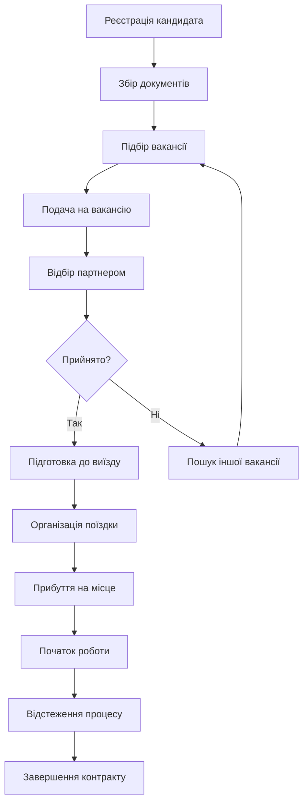
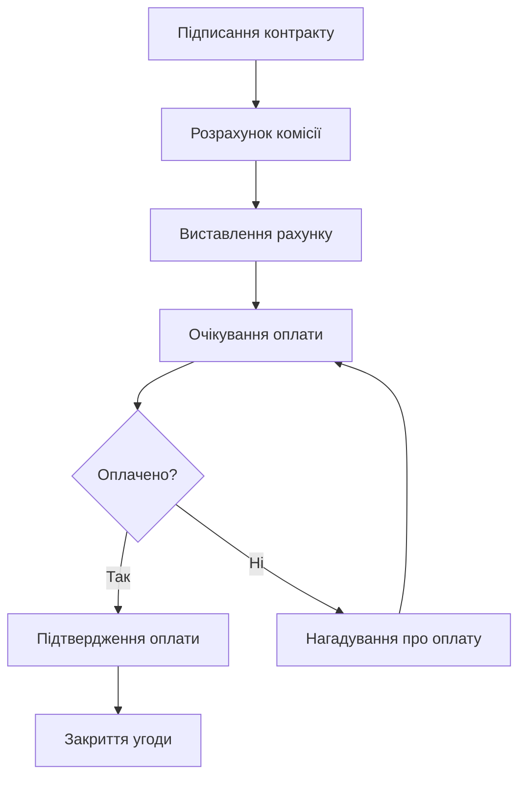

# 📋 Європа Сервіс CRM - Бізнес Логіка та Процеси

## 📊 **Загальна інформація про проект**

**Назва:** Європа Сервіс CRM  
**Тип:** Система управління персоналом та працевлаштування  
**Статус:** В розробці / Продакшн  
**Версія:** 2.4  
**Останнє оновлення:** 2025-01-15  

---

## 🎯 **Єдина CRM система (v2.4) - Заміна Бітрікс + Excel + Discord**

### **Проблема:**
- **Розпорошеність даних** між трьома системами
- **Дублювання інформації** в Бітрікс, Excel та Discord
- **Неефективна комунікація** через різні платформи
- **Складність синхронізації** даних між системами

### **Рішення:**
- **Єдина CRM платформа** замість трьох окремих систем
- **Вбудований чат** з інтеграцією CRM даних
- **Автоматична синхронізація** всіх даних в одному місці
- **Згадування контактів/угод** прямо в чаті

### **Архітектура дашборду:**
- **Ліва частина (60%):** Статистика, метрики, швидкі дії
- **Права частина (40%):** Командний чат з каналами
- **Згортання чату** для повноекранного дашборду
- **Адаптивний дизайн** під різні розміри екранів

### **Функціональність чату:**
- **Канали:** загальний, маркетинг, техпідтримка, по філіях
- **Згадування:** @контакт_123, #угода_456
- **Файлообмін:** прикріплення документів до контактів
- **Історія:** всі повідомлення зберігаються в CRM
- **Пошук:** по контактах, угодах, повідомленнях

---

## 📝 **Сучасний попап створення контактів (v2.5)**

### **Дизайн та UX:**
- **Bitrix-стиль**: напівпрозорий попап з бічним відкриттям (w-2/5)
- **Округлі кути**: повністю округлий дизайн (rounded-2xl)
- **Відступи**: right-4 top-4 bottom-4 для комфортного розташування
- **Білий фон**: чистий білий фон з тінями (shadow-2xl)
- **Красивий шрифт**: font-sans для читабельності

### **Кольорова схема блоків:**
- **Основна інформація**: сині градієнти (from-blue-400 to-indigo-500)
- **Контакти**: зелений градієнт (from-emerald-400 to-teal-500)
- **Документи**: фіолетовий градієнт (from-purple-400 to-violet-500)
- **Робота**: помаранчевий градієнт (from-orange-400 to-red-400)
- **Особиста інформація**: рожевий градієнт (from-pink-400 to-rose-500)
- **Додатково**: сірий градієнт (from-slate-400 to-gray-500)
- **Файли**: блакитний градієнт (from-cyan-400 to-blue-500)

### **Емодзі акценти:**
- **Основна інформація**: 👤
- **Контакти**: 📞
- **Документи**: 📄
- **Робота**: 💼
- **Особиста інформація**: 👨‍👩‍👧‍👦
- **Додатково**: 📝
- **Файли**: 📎
- **Прозорість**: opacity-60 для ненав'язливості

### **Поля вводу:**
- **Висота**: h-8 для комфортного введення
- **Шрифт**: text-sm для читабельності
- **Фон**: bg-white з світлими бордерами
- **Focus**: focus:ring-2 focus:ring-blue-500
- **2-колонкова сітка**: grid-cols-2 для оптимізації простору

### **Кнопка закриття:**
- **Позиція**: зліва від попапу з плавним переходом
- **Дизайн**: білий фон з чорним хрестиком
- **Hover**: hover:bg-gray-100
- **Бордер**: border-gray-300 для визначення

### **Мініатюри файлів:**
- **Розмір**: h-16 (64px) для компактності
- **Фон**: bg-white з тінями
- **Клікабельність**: клік відкриває повнорозмірний перегляд
- **Z-index**: z-[100] для відображення поверх попапу
- **Підтримка**: зображення та PDF файли

### **Модальне вікно перегляду:**
- **Поверх попапу**: z-[100] гарантує відображення поверх всіх елементів
- **Клік для закриття**: поза модальним вікном
- **Stop propagation**: клік всередині не закриває вікно
- **Розмір**: max-h-[90vh] для максимального використання екрану

---

## 👁️ **Попап перегляду контакту (v2.6)**

### **Архітектура:**
- **Той же стиль**: ідентичний дизайн з попапом створення
- **Тільки читання**: всі поля неактивні для редагування
- **Кнопка редагування**: значок олівця в заголовку та кнопка внизу
- **Перехід в редагування**: закриває поточний попап і відкриває форму редагування

### **Функціональність:**
- **Відображення всіх полів**: основна інформація, контакти, документи, робота, особиста інформація, додатково
- **Згортання блоків**: можливість згортати/розгортати секції
- **Мініатюри файлів**: відображення завантажених документів
- **Перегляд файлів**: клік на мініатюру відкриває повнорозмірний перегляд
- **Інформація про менеджера**: відображення відповідального менеджера

### **UX переходи:**
- **Перегляд → Редагування**: плавний перехід між режимами
- **Закриття попапу**: повернення до таблиці контактів
- **Без переходів на сторінки**: все відбувається в рамках інтерфейсу

---

## ✏️ **Попап редагування контакту (v2.7)**

### **Архітектура:**
- **Ідентичний дизайн**: той же стиль що й попап створення
- **Попередньо заповнені поля**: всі дані контакту автоматично завантажуються
- **Режим редагування**: можливість зміни всіх полів
- **Збереження змін**: оновлення контакту в базі даних

### **Функціональність:**
- **Автозаповнення**: useEffect завантажує дані контакту при відкритті
- **Валідація**: перевірка обов'язкових полів перед збереженням
- **Оновлення контакту**: передача оновлених даних через onSave callback
- **Файли**: можливість додавання нових файлів до існуючих

### **UX переходи:**
- **Перегляд → Редагування**: кнопка "Редагувати" відкриває попап редагування
- **Редагування → Збереження**: збереження змін і закриття попапу
- **Редагування → Скасування**: закриття без збереження змін

---

## 🎨 **Оновлений дизайн попапів (v2.9)**

### **Повноекранний дизайн:**
- **На всю висоту**: попап займає всю висоту екрану (top-0 bottom-0)
- **Без округлення внизу**: тільки rounded-l-2xl (округлення зліва)
- **Притиснутий до краю**: right-0 замість right-4
- **Максимальне використання простору**: більше місця для контенту

### **Кнопки в заголовку:**
- **Емодзі замість тексту**: 💾 (зберегти), ❌ (закрити), ✏️ (редагувати)
- **Компактний розмір**: h-6 w-6 для економії місця
- **Hover ефекти**: зелені для збереження, червоні для закриття, сині для редагування
- **Без footer**: прибрано нижню панель з кнопками

### **Переваги нового дизайну:**
- **Більше контенту**: максимальне використання простору екрану
- **Швидший доступ**: кнопки дій завжди видимі в заголовку
- **Сучасний вигляд**: емодзі роблять інтерфейс більш дружнім
- **Консистентність**: однаковий дизайн для всіх попапів

---

## 📁 **Зберігання файлів (v2.8)**

### **Рекомендований підхід:**
- **Хмарне сховище**: Amazon S3, Google Cloud Storage, або Cloudinary
- **Безпека**: ніколи не завантажувати файли безпосередньо з фронтенду
- **Проміжний бекенд**: обробка файлів через API маршрути Next.js

### **Архітектура зберігання:**
1. **Завантаження з клієнта**: файл відправляється на бекенд
2. **Обробка на бекенді**: валідація, зміна імені, завантаження в хмару
3. **Збереження URL**: URL файлу зберігається в базі даних
4. **Відображення**: використання URL для показу файлів

### **Переваги хмарного сховища:**
- **Масштабованість**: обробка великих обсягів файлів
- **Надійність**: висока доступність та стійкість до збоїв
- **Безпека**: вбудовані механізми контролю доступу
- **CDN інтеграція**: швидка доставка файлів по всьому світу

---

## 🖥️ **Повноекранний CRM Layout (v2.3)**

### **Архітектура інтерфейсу:**
- **Повноекранний режим** з використанням всієї висоти екрану (h-screen)
- **Фіксована бічна панель навігації** з можливістю згортання/розгортання (208px/64px)
- **Фіксована верхня панель дій** з пошуком, сповіщеннями та налаштуваннями
- **Максимальна інформація** в одному вигляді без прокрутки
- **Компактний дизайн** з меншими шрифтами та відступами для економії простору

### **Компоненти Layout:**
- **CRMLayout** - основний компонент обгортки для всіх модулів
- **Фіксована бічна панель** з логотипом, навігацією та профілем користувача
- **Навігаційні пункти** з іконками та сповіщеннями (червоні бейджі)
- **Динамічний заголовок** залежно від поточної сторінки
- **Стабільна навігація** - бічна панель залишається відкритою при переході між модулями

### **Оптимізація контенту:**
- **Розширена таблиця контактів** з додатковими колонками
- **Горизонтальний скрол** для таблиць з багатьма колонками
- **Компактний дизайн** з меншими відступами
- **Сортування та фільтрація** по всіх колонках

---

## 🏗️ **Основы CRM системи**

### **Фіксована навігація:**
- **Бічна панель** завжди залишається відкритою при переході між модулями
- **Верхня панель** з пошуком, сповіщеннями та налаштуваннями завжди видима
- **Стабільний стан** - користувач не втрачає контекст при навігації

### **Компактний дизайн:**
- **Ширина бічної панелі:** 208px (розгорнута) / 64px (згорнута)
- **Шрифти:** text-xs для навігації, text-sm для заголовків
- **Відступи:** зменшені для економії простору
- **Іконки:** 16x16px для компактності

### **Функціональність:**
- **Згортання/розгортання** бічної панелі зберігається
- **Активний стан** модуля підсвічується
- **Сповіщення** відображаються червоними бейджами
- **Компактний профіль користувача** з аватаркою та іконкою виходу

---

## 🎯 **Бізнес-модель та цілі**

### **Основна діяльність:**
- Ліцензоване кадрове агенство
- Працевлаштування в країнах Європи
- Робота з партнерами в Польщі, Німеччині, Чехії та інших країнах ЄС

### **Цільові показники:**
- **Кандидати:** 1000+ активних кандидатів
- **Вакансії:** 100+ активних вакансій
- **Оборот:** €2.4M+ загальний оборот
- **Філії:** 5 філій по Україні

---

## 👥 **Ролі та права доступу**

### **ADMIN (Системний адміністратор)**
- ✅ Повний доступ до всіх модулів
- ✅ Управління користувачами
- ✅ Перегляд видалених записів
- ✅ Аудит логів та відкат змін
- ✅ Налаштування системи

### **DIRECTOR (Директор)**
- ✅ Перегляд статистики
- ✅ Доступ до фінансових звітів
- ✅ Управління кандидатами
- ✅ Перегляд всіх філій

### **MANAGER (Менеджер)**
- ✅ Управління кандидатами своєї філії
- ✅ Перегляд вакансій
- ✅ Робота з поданнями
- ❌ Немає доступу до статистики

### **ACCOUNTANT (Бухгалтер)**
- ✅ Перегляд статистики
- ✅ Фінансові звіти
- ✅ Оплати та витрати
- ✅ Зарплати співробітників

### **EMPLOYEE (Співробітник)**
- ✅ Базовий доступ до кандидатів
- ✅ Перегляд вакансій
- ❌ Обмежені права редагування

---

## 🏢 **Структура філій**

### **Центральний офіс (ЦО)**
- **Локація:** Київ
- **Роль:** Координація всіх філій
- **Менеджер:** Системний адміністратор

### **Регіональні філії:**
1. **Київ** - Центральна філія
2. **Львів** - Західна філія  
3. **Одеса** - Південна філія
4. **Харків** - Східна філія
5. **Дніпро** - Центрально-східна філія

---

## 📋 **Основні модулі системи**

### **1. Кандидати** 👥
**Призначення:** Управління базою кандидатів

**Поля даних:**
- **Особисті дані:** Ім'я, прізвище, телефон, email, вік
- **Документи:** Паспорт, термін дії, номер заявки
- **Освіта:** Рівень освіти, досвід роботи, мовні навички
- **Сім'я:** Сімейний стан, кількість дітей
- **Робота:** Країна призначення, проект, партнер
- **Статуси:** Статус кандидата, оплата, дата прибуття
- **Фінанси:** Сума оплати, статус оплати, тип отримувача

**Статуси кандидатів:**
- 🆕 **Зареєстровано** - Новий кандидат
- ⏳ **Готовий до виїзду** - Підготовлений до поїздки
- 🚌 **В дорозі** - Їде до місця роботи
- ✅ **Прибув** - Прибув на місце
- 💼 **Працює** - Активно працює
- 🏁 **Завершив роботу** - Завершив контракт
- ❌ **Не доїхав** - Не прибув на місце
- ⏰ **Очікується** - Очікується прибуття

**Процеси:**
1. **Реєстрація** → Створення профілю кандидата
2. **Підготовка** → Збір документів, підготовка до виїзду
3. **Відправка** → Організація поїздки
4. **Прибуття** → Підтвердження прибуття
5. **Робота** → Відстеження робочого процесу
6. **Завершення** → Завершення контракту

**Детальна картка кандидата:**
- **Поп-ап редагування** - повний доступ до всіх полів кандидата
- **Вкладки:** Особисті дані, Документи, Робота, Угода
- **Особисті дані:** Ім'я, прізвище, телефон, email, вік, країна, паспорт, освіта, досвід, мови, сім'я
- **Документи:** Завантаження файлів (PDF, JPG, PNG, DOC, DOCX)
- **Робота:** Країна, проект, партнер, дата прибуття, місто, адреса, транспорт, контакти, фінанси
- **Угода:** Стадія, статус, сума, валюта, дата завершення, коментарі
- **Збереження змін** - автоматичне оновлення даних

### **2. Вакансії** 💼
**Призначення:** Управління вакансіями партнерів

**Поля даних:**
- Назва вакансії
- Країна роботи
- Опис роботи
- Вимоги до кандидата
- Зарплата
- Умови роботи
- Контакти партнера

**Процеси:**
1. **Отримання** → Отримання вакансії від партнера
2. **Публікація** → Розміщення в системі
3. **Підбір** → Пошук підходящих кандидатів
4. **Подача** → Подача кандидатів на вакансію
5. **Відбір** → Процес відбору партнером
6. **Прийняття** → Підтвердження найму

### **3. Подання** 📋
**Призначення:** Управління поданнями кандидатів на вакансії

**Поля даних:**
- Кандидат
- Вакансія
- Дата подання
- Статус подання
- Коментарі партнера
- Результат відбору

**Статуси подань:**
- 📤 **Подано** - Подано на розгляд
- 👀 **Розглядається** - Партнер розглядає
- ✅ **Прийнято** - Кандидат прийнятий
- ❌ **Відхилено** - Кандидат відхилений
- ⏳ **Очікується** - Очікується рішення

### **4. Оплати** 💰
**Призначення:** Облік платежів від партнерів

**Поля даних:**
- Кандидат
- Сума оплати
- Дата оплати
- Статус оплати
- Тип отримувача
- Банківські реквізити
- Спосіб оплати
- Номер референсу

**Статуси оплат:**
- ✅ **Оплачено** - Повністю оплачено
- 🔄 **Частково оплачено** - Часткова оплата
- ❌ **Не оплачено** - Не оплачено
- ⏰ **Очікується** - Очікується оплата

### **5. Статистика** 📊
**Призначення:** Аналітика та звітність

**Доступ:** Тільки для DIRECTOR, ACCOUNTANT, ADMIN

**Метрики:**
- Загальна кількість кандидатів
- Кількість активних вакансій
- Конверсія по філіях
- Фінансові показники
- Статистика по країнах
- Воронка конверсії

### **6. Виплати партнерів** 💸
**Призначення:** Виплати від партнерів (конфіденційно)

**Поля даних:**
- Партнер
- Сума виплати
- Дата виплати
- Тип виплати
- Комісія
- Статус виплати

### **7. Зарплати** 💵
**Призначення:** Зарплати співробітників та бонуси

**Доступ:** DIRECTOR, ACCOUNTANT, ADMIN

**Структура зарплати:**
- **Базова ставка** - фіксована місячна зарплата
- **Бонус за показники** - за кількість оплачених кандидатів
- **Бонус за візи** - комісія від продажу віз
- **Бонус за безкоштовних** - за кандидатів що доїхали безкоштовно
- **Загальна сума** - сума всіх компонентів

**Логіка розрахунку зарплат (оновлена з урахуванням угод):**

#### **Менеджери (MANAGER):**
```javascript
// Базові показники з угод
const completedDeals = угоди_з_статусом_завершена_за_місяць
const paidDeals = угоди_з_оплатою_за_місяць
const freeDeals = угоди_безкоштовні_за_місяць
const arrivedDeals = угоди_де_кандидати_доїхали

// Градація бонусу за завершені угоди
let gradationRate = 300  // базова ставка за угоду
if (completedDeals > 30) gradationRate = 600    // 30+ угод
else if (completedDeals > 20) gradationRate = 500  // 20-29 угод  
else if (completedDeals > 10) gradationRate = 400  // 10-19 угод

// Розрахунок компонентів
const baseSalary = менеджер.базова_ставка
const bonus = paidDeals * gradationRate
const freeBonus = arrivedDeals * 100
const visaBonus = сума_комісій_від_віз_за_місяць

// Загальна зарплата
const total = baseSalary + bonus + visaBonus + freeBonus
```

#### **Керівники філій (BRANCH_MANAGER):**
```javascript
// Показники філії
const branchPaidCount = кількість_оплачених_кандидатів_філії_за_місяць

// Розрахунок
const baseSalary = 0  // немає базової ставки
const bonus = branchPaidCount * 250  // 250 грн за кожного оплаченого
const visaBonus = 0
const freeBonus = 0

// Загальна зарплата
const total = bonus
```

#### **Адміністратори (ADMIN):**
```javascript
// Фіксована зарплата без бонусів
const baseSalary = адміністратор.базова_ставка
const bonus = 0
const visaBonus = 0
const freeBonus = 0

// Загальна зарплата
const total = baseSalary
```

**Показники для розрахунку:**
- **Оплачені кандидати** - кандидати з `isFree = false`
- **Безкоштовні кандидати** - кандидати з `isFree = true`
- **Доїхали** - кандидати з `arrivedStatus = 'Доїхав'`
- **Комісії від віз** - сума з таблиці `VisaSale`

**Градація бонусів менеджерів:**
- 🥉 **10-19 кандидатів** - 400 грн за кожного
- 🥈 **20-29 кандидатів** - 500 грн за кожного  
- 🥇 **30+ кандидатів** - 600 грн за кожного
- 📊 **Менше 10** - 300 грн за кожного

**Бонуси керівників філій:**
- 💰 **250 грн** за кожного оплаченого кандидата філії
- 🎯 **Тільки за показники філії** - немає базової ставки

### **8. Витрати філій** 📈
**Призначення:** Облік витрат філій

**Категорії витрат:**
- 🏢 **Оренда** - Оренда офісів
- 📞 **Комунікації** - Телефон, інтернет
- 📢 **Маркетинг** - Реклама, просування
- 📄 **Канцтовари** - Офісні приналежності
- 🚗 **Транспорт** - Поїздки, бензин
- 🍽️ **Харчування** - Корпоративні заходи
- 🔧 **Інше** - Інші витрати

### **9. Користувачі** 👤
**Призначення:** Управління користувачами системи

**Поля даних:**
- Логін та пароль
- Роль в системі
- Повне ім'я
- Філія
- Email та телефон
- Статус активності

### **11. Контакти та Угоди** 🤝
**Призначення:** Система контактів та угод для роботи з потенційними кандидатами

**Основні концепції:**
- **Контакт** - потенційний кандидат без ID, ще не офіційно оформлений
- **Угода** - група контактів, які їдуть разом на одну роботу
- **Кандидат** - офіційно оформлений контакт після підтвердження угоди адміном

**Життєвий цикл:**
1. **Контакт** → 2. **Угода** → 3. **Підтвердження адміном** → 4. **Кандидат**

**Поля даних контакту:**
- **Особисті дані:** Ім'я, прізвище (як в закордонному паспорті), телефон, вік - **ОБОВ'ЯЗКОВІ**
- **Робота:** Країна роботи, проект, статус контакту
- **Додаткова інформація:** Примітки, дата створення, менеджер, філія

**Система відповідальності за контакти:**
- **Автоматичне призначення:** При створенні контакту автоматично призначається менеджер який його створив
- **Передача відповідальності:** Можлива тільки за згодою оригінального менеджера або директора/адміністратора
- **Відстеження передач:** Всі зміни відповідального логуються з причиною та датою
- **Поля для логування передач:**
  - `originalManagerId` - ID оригінального менеджера
  - `transferredAt` - дата передачі
  - `transferredBy` - хто передав (ID користувача)
  - `transferReason` - причина передачі

**Перевірка дублів контактів:**
- **Критерії дублів:** Телефон + Ім'я + Прізвище + Вік
- **Обов'язкові поля:** Телефон, ім'я, прізвище, вік - не можна створити контакт без цих даних
- **Процес перевірки дублів:**
  1. При створенні контакту система перевіряє по всій базі
  2. Якщо знайдено дубль - показує попередження з даними існуючого контакту
  3. Показує менеджера, який створив контакт раніше
  4. Запропонувати варіанти:
     - "Створити все одно" (з приміткою про дубль)
     - "Скасувати"
     - "Запросити зміну відповідального" (відправляє запит менеджеру)
- **Запит на зміну відповідального:**
  - Система відправляє запит менеджеру, який створив контакт
  - Показує дані нового менеджера та причину запиту
  - Менеджер може підтвердити або відхилити передачу
  - Директор та адміністратор можуть передавати без згоди
  - Після підтвердження контакт переходить до нового менеджера

**Форма створення контакту з згортанням блоків:**
- **Структура форми з блоками:**
  1. **Основна інформація** (завжди розгорнута, обов'язкова)
  2. **Контактна інформація** (Email, Viber, Польський номер)
  3. **Документи** (Паспорт, PESEL, прописка)
  4. **Робота** (Країни, проект, досвід, мови)
  5. **Особиста інформація** (Сімейний стан, діти)
  6. **Додаткова інформація** (Примітки)
- **Функціональність згортання:** Кожен блок можна згортати/розгортати для мінімізації скролінгу
- **Відображення відповідального:** Показується в окремому блоці зверху форми з аватаром та інформацією

**Поля даних угоди:**
- **Основна інформація:** Назва, опис, менеджер, філія
- **Робота:** Країна, проект, партнер, місто, адреса
- **Дата та транспорт:** Дата прибуття, тип транспорту, контакти
- **Фінанси:** Загальна сума, валюта
- **Статуси:** Стадія угоди, статус угоди

**Стадії угод:**
- 🆕 **Створена** - Угода створена менеджером
- 📝 **В роботі** - Угода в процесі обробки
- ✅ **Готова** - Угода готова до відправки
- 👨‍💼 **На розгляді** - Угода на розгляді адміністратора
- ✅ **Підтверджена** - Угода підтверджена адміністратором
- 📤 **Відправлена** - Угода відправлена партнеру
- 🏁 **Завершена** - Угода завершена

**Процес роботи з контактами та угодами:**

#### **Для менеджерів:**
1. **Створення контакту** - додавання основних даних потенційного кандидата
2. **Редагування контакту** - оновлення інформації про контакт
3. **Створення угоди** - групування контактів для спільної поїздки
4. **Заповнення даних угоди** - детальна інформація про роботу
5. **Позначення готовності** - статус "Готова" для відправки адміну

#### **Для адміністраторів:**
1. **Перегляд готових угод** - фільтр по статусу "Готова"
2. **Перевірка та підтвердження** - статус "Підтверджена"
3. **Автоматичне створення кандидатів** - контакти стають кандидатами з ID
4. **Додавання до загальної таблиці** - кандидати з'являються в таблиці "Кандидати"
5. **Відправка партнеру** - статус "Відправлена"

**Автоматизація:**
- **Контакти** не мають ID до підтвердження угоди
- **Кандидати** створюються автоматично після підтвердження угоди
- **Таблиця кандидатів** формується автоматично з підтверджених угод
- **Сортування** кандидатів по менеджерам відбувається автоматично

**Права доступу:**
- **MANAGER** - створення та редагування контактів та угод своєї філії
- **ADMIN/DIRECTOR** - перегляд всіх угод, підтвердження, відправка партнерам

## Модуль Статистика

**Призначення:** Централізований модуль для аналізу роботи системи з роль-базованим доступом до даних.

**Роль-базована логіка доступу:**

### **Менеджер (MANAGER)**
- **Бачить:** Тільки свою статистику
- **Метрики:**
  - Всього клієнтів (створених менеджером)
  - Працюють (статус "Працює")
  - Готові до виїзду (статус "Готовий до виїзду")
  - В угодах (статус "В угоді")
  - Всього угод (створених менеджером)
  - Активні угоди
  - В очікуванні угоди
  - Завершені угоди
  - Загальний дохід від угод

### **Керівник філії (DIRECTOR)**
- **Бачить:** Статистику своєї філії + деталізацію по менеджерах
- **Метрики:**
  - Всі метрики менеджера (агреговані по філії)
  - **Додатково:** Таблиця статистики по менеджерах філії:
    - Ім'я менеджера
    - Філія
    - Кількість клієнтів
    - Кількість угод
    - Дохід від угод

### **Адміністратор (ADMIN)**
- **Бачить:** Загальну статистику по всіх філіях + деталізацію по менеджерах
- **Метрики:**
  - Всі метрики менеджера (агреговані по всій системі)
  - **Додатково:** Таблиця статистики по всіх менеджерах:
    - Ім'я менеджера
    - Філія
    - Кількість клієнтів
    - Кількість угод
    - Дохід від угод

**Функціональність:**
- **Фільтр по часу:** Тиждень, місяць, квартал, рік
- **Автоматичне оновлення:** Дані оновлюються в реальному часі
- **Експорт даних:** Можливість експорту статистики (майбутня функція)
- **Графіки та діаграми:** Візуалізація трендів (майбутня функція)

**Технічна реалізація:**
- **API:** `/api/statistics` - отримання статистики з фільтрацією по ролі
- **Компонент:** `StatisticsPage` - головна сторінка модуля
- **Фільтрація:** Автоматична фільтрація даних по `managerId`, `branch` залежно від ролі
- **Кешування:** Кешування статистики для оптимізації продуктивності

**Інтеграція з іншими модулями:**
- **Клієнти:** Статистика клієнтів перенесена з модуля "Клієнти"
- **Угоди:** Статистика угод перенесена з модуля "Клієнти"
- **Кандидати:** Можливість додавання статистики кандидатів (майбутня функція)
- **Платежі:** Інтеграція з фінансовою статистикою (майбутня функція)
- **ACCOUNTANT** - перегляд фінансової інформації угод

**Інтеграція з іншими модулями:**
- **Кандидати** - автоматичне створення з підтверджених угод
- **Статистика** - підрахунок угод по філіях та менеджерах
- **Зарплати** - розрахунок на основі завершених угод
- **Платежі** - прив'язка до конкретних угод

### **12. Видалені записи** 🗑️
**Призначення:** Перегляд та відновлення видалених записів

**Доступ:** Тільки для ADMIN

**Функції:**
- Перегляд видалених кандидатів
- Відновлення записів
- Перегляд історії видалень
- Остаточне видалення

---

## 🔄 **Бізнес-процеси**

### **Процес працевлаштування:**



### **Процес оплати:**



---

## 📊 **KPI та метрики**

### **Операційні метрики:**
- **Кількість кандидатів:** Загальна та активна база
- **Конверсія:** Від реєстрації до працевлаштування
- **Час обробки:** Середній час від реєстрації до виїзду
- **Успішність:** Відсоток успішних працевлаштувань

### **Фінансові метрики:**
- **Оборот:** Загальний оборот по місяцях
- **Прибуток:** Чистий прибуток після витрат
- **Середній чек:** Середня сума за кандидата
- **ROI:** Окупність інвестицій

### **Якісні метрики:**
- **Задоволеність:** Відгуки кандидатів та партнерів
- **Повторні клієнти:** Відсоток повторних звернень
- **Рекомендації:** Кількість рекомендацій

---

## 🔧 **Технічні процеси**

### **Розрахунок зарплат (автоматичний):**
- **Щомісячний процес** - розрахунок на початку кожного місяця
- **Джерела даних:**
  - `Application` - заявки кандидатів за місяць
  - `VisaSale` - продажі віз за місяць
  - `User` - базові ставки співробітників
- **Алгоритм розрахунку:**
  1. Отримання всіх заявок за попередній місяць
  2. Підрахунок показників по кожному менеджеру
  3. Застосування градації бонусів
  4. Розрахунок комісій від віз
  5. Створення записів `MonthlySalary`
- **Компоненти зарплати:**
  - `baseSalary` - базова ставка з профілю користувача
  - `bonus` - бонус за оплачених кандидатів
  - `visaBonus` - комісія від продажу віз
  - `freeBonus` - бонус за безкоштовних що доїхали
  - `total` - сума всіх компонентів
  - `indicators` - кількість оплачених кандидатів

### **Аудит та логування:**
- Всі зміни записуються в аудит лог
- Можливість відкату змін
- Історія дій користувачів
- Soft delete для всіх записів

### **Безпека:**
- JWT токени для авторизації
- Роль-базова система доступу
- Шифрування паролів
- Валідація всіх вхідних даних

### **Оптимізація:**
- Оптимістичні UI оновлення
- Debounced оновлення для продуктивності
- Пагінація для великих таблиць
- Кешування часто використовуваних даних

---

## 📝 **Зміни та оновлення**

### **2024-10-15 - Версія 2.2 - Система угод та групових кандидатів**
**Нова архітектура з угодами:**
- ✅ **Модель Deal (Угода)** - центральна сутність для групування кандидатів
- ✅ **DealCandidate** - проміжна таблиця для зв'язку угод з кандидатами
- ✅ **Ролі кандидатів** - candidate, spouse, child, friend
- ✅ **Стадії угод** - Створена → Внесення даних → Готово для адміна → Схвалено адміном → Подано партнеру
- ✅ **API для угод** - CRUD операції з угодами
- ✅ **Групування кандидатів** - можливість додавати 1-4 кандидатів в одну угоду

**Бізнес-логіка угод:**
- ✅ **Менеджери** створюють угоди з кандидатами своєї філії
- ✅ **Статус "Готово для адміна"** - менеджер завершив роботу з угодою
- ✅ **Адміністратори** бачать готові угоди та можуть їх схвалювати
- ✅ **Подача партнеру** - адмін подає схвалену угоду роботодавцю
- ✅ **Статистика та зарплати** розраховуються на основі угод

**Технічні покращення:**
- ✅ Нові моделі Prisma: Deal, DealCandidate, DealActivity, DealDocument
- ✅ API ендпоінти: /api/deals, /api/deals/[id]
- ✅ Оновлені типи TypeScript для угод
- ✅ Підтримка групових кандидатів (сім'ї, друзі)

### **2024-10-15 - Версія 2.1 - Детальна картка клієнта**
**Нові функції детальної картки клієнта:**
- ✅ **Детальна картка кандидата** з повною інформацією про угоду
- ✅ **Стрічка активності** з історією дій та коментарів
- ✅ **Управління документами** з можливістю завантаження файлів
- ✅ **Бізнес-процеси** з відстеженням стадій угоди
- ✅ **Розширені поля** для детальної інформації про кандидата
- ✅ **API ендпоінти** для роботи з активностями та документами
- ✅ **Інтеграція** з основною таблицею кандидатів

**Технічні покращення:**
- ✅ Нові моделі Prisma: Activity, Document
- ✅ Розширені поля в моделі Candidate
- ✅ API ендпоінти: /api/candidates/[id]/detail, /activities, /documents
- ✅ Сторінка детальної картки: /candidates/[id]
- ✅ Кнопка відкриття детальної картки в таблиці кандидатів

**Бізнес-логіка:**
- ✅ **Стадії угоди:** Внесення даних, В резерві, В резерві (без оплати), Завершити угоду
- ✅ **Статуси угоди:** Активна, Завершена, Скасована, Призупинена
- ✅ **Типи активностей:** comment, call, task, stage_change, document_uploaded, payment_received
- ✅ **Типи документів:** receipt, invoice, contract, passport, visa, other
- ✅ **Права доступу** збережені для всіх ролей користувачів
- ✅ **Аудит логування** всіх змін в детальній картці

### **2024-12-19 - Версія 2.0**
**Зміни в дизайні:**
- ✅ Повністю новий iOS-подібний дизайн
- ✅ Оновлена головна сторінка з модулями
- ✅ Сучасна сторінка кандидатів з статистикою
- ✅ Покращена сторінка логіну з анімаціями
- ✅ Нові глобальні стилі та кольорова схема

**Технічні покращення:**
- ✅ Новий компонент ModernCandidatesTable
- ✅ Покращені анімації та переходи
- ✅ Адаптивний дизайн для всіх пристроїв
- ✅ Backdrop blur ефекти
- ✅ Покращені скролбари та фокус стани

**Бізнес-логіка:**
- ✅ Збережена вся існуюча функціональність
- ✅ Покращена UX взаємодія
- ✅ Оптимізована продуктивність
- ✅ **НОВЕ:** Детальна логіка розрахунку зарплат менеджерів
- ✅ **НОВЕ:** Градація бонусів за кількість кандидатів (300-600 грн)
- ✅ **НОВЕ:** Розрахунок зарплат керівників філій (250 грн за кандидата)
- ✅ **НОВЕ:** Система бонусів за візи та безкоштовних кандидатів
- ✅ **НОВЕ:** Автоматичний щомісячний розрахунок зарплат

### **2024-10-14 - Виправлення критичної помилки**
**Проблема:** Inline редагування кандидатів не зберігалося в базу даних
- ❌ **Проблема:** При редагуванні полів кандидатів (ім'я, прізвище, телефон) зміни не зберігалися
- ❌ **Причина:** Неправильна логіка порівняння оригінальних та нових значень через оптимістичне оновлення UI
- ✅ **Виправлення:** Додано збереження оригінального значення на початку редагування
- ✅ **Результат:** Inline редагування тепер працює коректно і зберігає дані в БД

**Технічні деталі виправлення:**
- Додано стан `originalValue` для збереження початкового значення поля
- Оновлено `handleCellClick` для збереження оригінального значення
- Виправлено `handleCellBlur` для порівняння з правильним оригінальним значенням
- Додано детальне логування для діагностики проблем
- Покращено логіку порівняння значень з урахуванням типів даних

### **Планується в майбутньому:**
- 📱 Мобільна версія додатку
- 📧 Email нотифікації
- 📊 Розширена аналітика
- 🔗 API для інтеграцій
- 🌐 Багатомовність
- 📈 Машинне навчання для підбору кандидатів

---

## 📱 **Система контактів та угод (Нова архітектура)**

### **Життєвий цикл контакту:**
1. **Створення контакту** - менеджер створює контакт з обов'язковими полями
2. **Перевірка дублів** - система перевіряє по телефону, імені, прізвищу, віку
3. **Призначення відповідального** - автоматично призначається менеджер-створювач
4. **Створення угоди** - контакт додається до угоди
5. **Підтвердження адміном** - угода переходить в статус "Підтверджено"
6. **Статус кандидата** - контакт стає кандидатом в головній таблиці

### **Обов'язкові поля контакту:**
- `firstName` - ім'я
- `lastName` - прізвище  
- `phone` - телефон (унікальний)
- `age` - вік

### **Система відповідальності за контакти:**
- **Автоматичне призначення** - менеджер, який створює контакт, стає відповідальним
- **Передача відповідальності** - можлива з згоди оригінального менеджера або директором/адміном
- **Логування змін** - всі передачі відповідальності записуються з датою, причиною та хто змінив

### **Перевірка дублів контактів:**
- **Критерії дублів:** телефон, ім'я, прізвище, вік
- **Процес:** система показує існуючий контакт та пропонує опції:
  - "Створити все одно" - ігнорувати дубль
  - "Скасувати" - не створювати
  - "Запросити передачу відповідальності" - відправити запит оригінальному менеджеру
- **Перевага директора/адміна** - можуть примусово передати відповідальність

### **Форма створення контакту з згортанням блоків:**
- **Основна інформація** - ім'я, прізвище, телефон, вік, статус
- **Контактна інформація** - email, Viber, польський телефон
- **Робота** - країни, проект, досвід, мови, права
- **Додаткова інформація** - сімейний стан, діти, примітки

---

## 🎨 **UI/UX Компоненти**

### **Excel-подібна таблиця контактів:**
- **Сортування** по всіх колонках (ім'я, телефон, вік, проект, країна, статус, дата)
- **Фільтрація** по статусу та пошук по тексту
- **Клікабельні імена** - переходять на детальну сторінку контакту
- **Дії:** перегляд, редагування, видалення
- **Відображення менеджера** з аватаркою та філією

### **Детальна сторінка контакту:**
- **Вкладки:** Загальне, Угоди, Бонуси, Зв'язки, Історія
- **Секції інформації:**
  - Відповідальний менеджер (ім'я, філія, дата створення)
  - Контактні дані
  - Перша сторінка закордонного паспорту (завантаження файлів)
  - Особисті дані
  - Робота
  - Примітки
- **Можливість редагування** через модальне вікно
- **Завантаження файлів** (фото паспортів тощо)

### **Компонент завантаження файлів:**
- **Drag & Drop** інтерфейс
- **Валідація** розміру (макс 10 МБ) та типу файлів
- **Прев'ю** завантажених файлів
- **Видалення** файлів
- **Підтримка** зображень для паспортів

---

## 🔧 **API Endpoints**

### **Контакти:**
- `GET /api/contacts` - отримання всіх контактів з фільтрацією
- `GET /api/contacts/[id]` - отримання одного контакту
- `POST /api/contacts` - створення контакту з перевіркою дублів
- `PUT /api/contacts/[id]` - оновлення контакту з правами доступу
- `DELETE /api/contacts/[id]` - видалення контакту

### **Угоди:**
- `GET /api/deals` - отримання всіх угод
- `POST /api/deals` - створення угоди
- `PUT /api/deals/[id]` - оновлення угоди
- `DELETE /api/deals/[id]` - видалення угоди

---

## 🗄️ **База даних (Prisma Schema)**

### **Модель Contact:**
```prisma
model Contact {
  id              Int       @id @default(autoincrement())
  firstName       String    // Обов'язкове
  lastName        String    // Обов'язкове
  phone           String    @unique // Обов'язкове, унікальне
  age             Int       // Обов'язкове
  
  // Відповідальність
  managerId       Int       // ID менеджера-створювача
  managerName     String    // Ім'я менеджера
  branch          String    // Філія менеджера
  
  // Передача відповідальності
  originalManagerId       Int?
  originalManagerName     String?
  transferredAt          DateTime?
  transferredBy          Int?
  transferredByName      String?
  transferReason         String?
  
  // Інші поля...
  createdAt       DateTime  @default(now())
  updatedAt       DateTime  @updatedAt
}
```

### **Модель ContactTransferRequest:**
```prisma
model ContactTransferRequest {
  id                Int       @id @default(autoincrement())
  contactId         Int
  fromManagerId     Int
  toManagerId       Int
  status            String    // pending, approved, rejected
  reason            String?
  requestedAt       DateTime  @default(now())
  
  // Схвалення
  approvedBy        Int?
  approvedByName    String?
  approvedAt        DateTime?
  adminNotes        String?
}
```

---

## 🚨 **Важливі нотатки**

### **Безпека даних:**
- Всі персональні дані кандидатів захищені
- Регулярні бекапи бази даних
- Аудит всіх дій користувачів
- Відповідність GDPR

### **Продуктивність:**
- Система оптимізована для слабких комп'ютерів
- Максимум 100 записів на сторінку
- Debounced оновлення для зменшення навантаження
- Кешування для часто використовуваних даних

### **Підтримка:**
- Документація для всіх процесів
- Тестові акаунти для різних ролей
- Логи для діагностики проблем
- Регулярні оновлення системи

---

## 📞 **Контакти та підтримка**

**Команда розробки:** Внутрішня команда Європа Сервіс  
**Технічна підтримка:** Через систему тикетів  
**Екстрені випадки:** Прямий зв'язок з адміністратором  

---

*Останнє оновлення: 2024-12-19*  
*Версія документа: 2.2*
